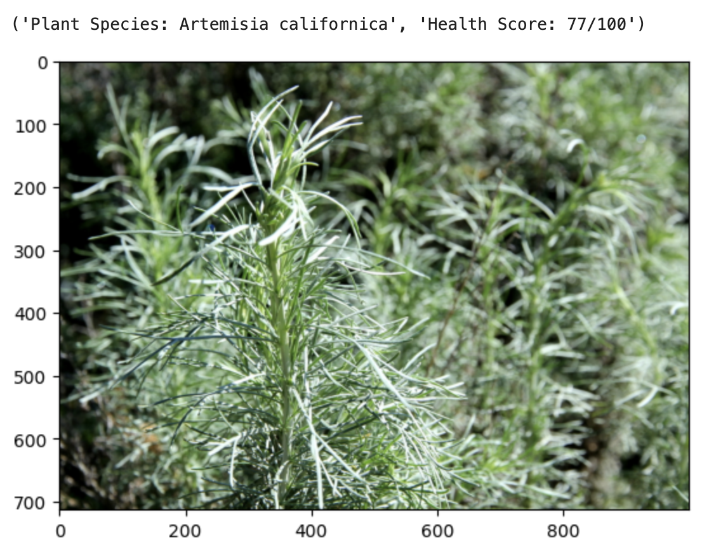

# USC-AI-Sustainability-Challenge-2023

For this 36 hour challenge, we propose an environment monitoring drone equipped with:
1. **Plant.id** for plant identification and health assessment
2. **ChatGPT** for foundational knowledge in response to collected plant data
3. **Tree-of-Thoughts** to design an expanded plan for ecology restoration.

## Project Summary
By combining drone data collection, advanced AI analytics, and a robust data dashboard, we at **EcoScan Technologies** provide advanced data and analytics to better monitor, predict, and protect vulnerable ecosystems. Our AI-powered software analyzes data from drone imagery to identify various native and invasive plant species, predict plant health, identify fire risks, and monitor soil properties.

## Results
Complete results from this challenge can be viewed in our [results/](results/) folder.
Example of Artemisia Californica identification

## Running the Code
Running the code will require a couple of API Keys. Please set them up at the following:
1. https://openai.com/blog/openai-api
2. https://web.plant.id/plant-identification-api/

API keys are best defined through environmental variables but for clarity feel free to see below. 

For PlantID_and_Health.ipynb - Add your API key to line 10. Feel free to add any plant images in the example_images/ folder and change the path in line 11
For RestorationPlanGenerator.ipynb - Add your API key as described here https://github.com/princeton-nlp/tree-of-thought-llm/blob/master/src/tot/models.py

## Additional Notes:
This prototype was designed with the following assumptions:

1. A drone w/ camera is available and can be programmed to navigate around an ecosystem.
2.  The tree-of-thoughts output assumes that substantial images have been analyzed with the PlantID_and_Health code.

For future work, developing the navigation algorithms, the communication between drone and servers, and testing the results of aggregated data should satisfy a physical demo of our product. Additional work is available to optimize the usage of LLMs as LLMs are intrinsically unsustainable to the environment due their energy consumption.

## Team
This work is performed by:
- Kevin Payumo
- Kamya Sud
- Jessica Mai
- Tatum Verona

## Thank you
Thank you to the AI/Sustainability Innovation Challenge Organizing Team, the Managing Directors of Entrepreneurship at Viterbi and Greif, and the Challenge organizing committee.
